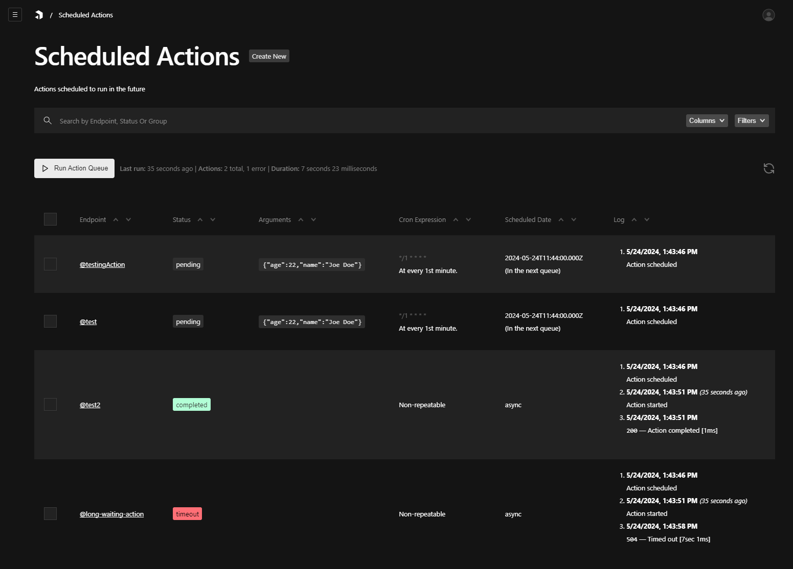
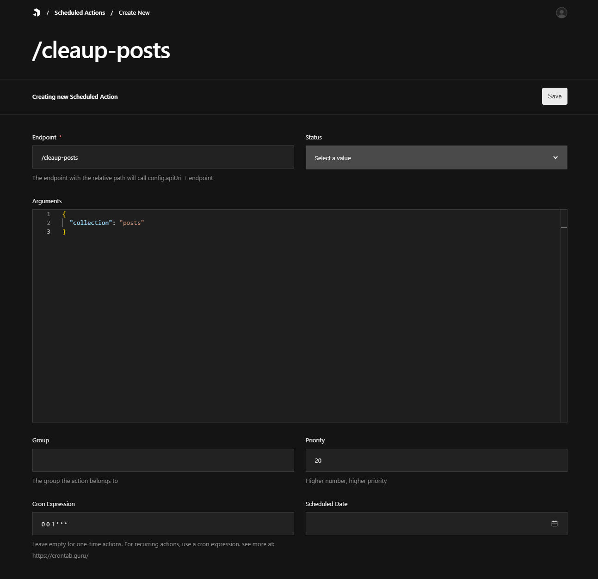

# Payload Action Scheduler (in alpha)
Add scheduled tasks to your Payload app effortlessly. Whether you need to postpone a task to a specific future time, set up periodic tasks, or offload tasks to run in the background, Payload Action Scheduler has you covered. With this plugin, you can monitor your task queues, see execution results, and track execution timestamps seamlessly.



### Note
The execution of the action scheduler depends on invoking the /api/scheduled-actions/run API. This can be achieved in two ways:

* **Serverless Environment**: Use an external scheduler (e.g., AWS CloudWatch, Google Cloud Scheduler) to call `/api/scheduled-actions/run` at regular intervals.
* **Node-Server Environment**: Set up a custom cron script (e.g., using node-cron) to regularly call `/api/scheduled-actions/run`.

## Features
* **Schedule Future Tasks**: Postpone tasks to execute at a specified future time.
* **Periodic Tasks**: Set up tasks to run at regular intervals.
* **Background Processing**: Offload tasks to run asynchronously in the background.
* **Task Monitoring**: Monitor your task queues, execution results, and timestamps.

## 1. How to Register a Task
You can register tasks either by writing your action inside an API endpoint or by including it in the actions array within the plugin configuration.

### Registering via API Endpoint
Define your action within an API endpoint. Here's an example of how to create an endpoint for clearing up posts:

```typescript
// app/api/cleanup-posts/route.ts
import { ActionSchedulerRoute } from '@/payload-action-scheduler';

export const POST = ActionSchedulerRoute(async (request, args) => {
    // args is an object containing the query parameters passed by scheduled action
    const collection = args['collection'];
    // payload instance is available in request
    const { payload } = request;

    // ... logic to clear up posts, payload instance is available
    // await payload.find(collection).deleteMany();

    return Response.json({ message: 'Post Cleared' }, { status: 200 });
});
```
### Registering within Plugin Configuration
Alternatively, you can register your actions directly within the plugin configuration. Here's an example:

```typescript
// payload.config.ts
plugins: [
  //... other plugins
  actionScheduler({
    // ... other configurations
    actions: [
      {
        endpoint: 'cleanup-posts',
        async handler(payload, args) {
            // ... logic to clear up posts
        }
      }
    ]
    // ... other configurations
  })
]
```

## 2. How to Schedule a Task

### Add Task via Payload Admin

1. **Required**: Add the endpoint by API URL if the action is defined in an API endpoint, or write the name of the action previously defined in the `pluginConfig.actions` array.
2. **Optional**: Define arguments in JSON format.
3. **Optional**: Group - the group tag by which actions can be grouped in view.
4. **Optional**: Priority - higher priority will be served sooner in the queue. Default 0
5. **Optional**: Cron expression - for recurring events, define the cron expression. **
6. **Optional**: Scheduled date - when the action will be executed, or when the recurring event starts executing. If a cron expression is defined but the scheduled date is not, the scheduled date will be defined in the earliest cycle defined by the cron expression. **

**Notes**:
** If both the cron expression and scheduled date are left empty, the action will be scheduled as async and will execute only once, as soon as possible (in the next queue cycle).

### Add Task Programmatically
You can also add tasks programmatically using the addAction function, following the same principles. Here's an example:

```typescript
import { addAction } from 'payload-action-scheduler';

await addAction({
  endpoint: 'test', // required, everything else optional
  cronExpression: '*/1 * * * *',
  args: {
    name: 'Joe Doe',
    age: 22,
  },
  scheduledAt: new Date(),
  group: 'test-group',
  priority: 1,
});
```

## 3. How does Action Scheduler work?
When the scheduled actions are properly set and scheduled, the action scheduler will be invoked at regular intervals by a custom cron-job script or an external service via a GET request to `/api/scheduled-actions/run`. It is important to set up this recurring invocation because, without it, the scheduler will not function.

When an action is added, the scheduler calculates the next closest scheduledAt timestamp. When `/api/scheduled-actions/run` is invoked, the action scheduler checks the database for scheduled actions with a status of pending and a scheduledAt timestamp that has passed the current datetime. It then sorts these actions based on priority and asynchronously executes all queued actions in parallel.

Each action logs its creation time, execution start time, execution result, and execution duration. These logs can be viewed in the Scheduled Actions Dashboard. If an action execution results in an error, you can hook into the error function to perform additional logging or send notifications about the failed action execution, as shown below:

```typescript
// payload.config.ts
plugins: [
  //... other plugins
  actionScheduler({
    // ... other configurations
    errorHooks: [
      async ({payload, action, message, code}) => {
        // your method
      }
    ]
    // ... other configurations
  })
]
```

After the action has finished executing, the scheduler updates the status of the action to either completed or failed, depending on the result of the execution, and if the action is a recurring event, it will reschedule the action based on the cron expression.

## 4. Known Gotchas
### Function Timeout in Serverless Runtime
In serverless environments, function execution time is capped by a timeout limit which varies depending on the hosting plan. For example, the default Hobby plan on Vercel has a timeout of 10 seconds. It's crucial to be aware of the timeout settings specific to your plan because this affects how long your functions can run before being forcibly terminated.

The Action Scheduler incorporates a mechanism to prevent a scheduled action from running too close to this limit. It is configured to attempt action execution up to the server action timeout minus one second. If this duration is exceeded, the action will be marked with the status "timed out."

Handling Timeouts
* **Timeout Configuration**: Ensure that the function timeout is set truthfully to the actual lambda function timeout. This setup helps in handling cases where the action execution might slightly exceed the expected duration.
* **Action Status and Rescheduling**: If an action exceeds its configured timeout, it will not be processed further in that cycle and will not be rescheduled if it is a recurring action. However, it will be marked with a "running" status and will be picked up in the next queue cycle for re-execution. This is important to be aware of, because this behavior can lead to multiplying action execution, which might not be desirable in some cases.

This setup helps ensure that even if an action times out due to an unusually long execution time, it will have another chance to complete in the next cycle without permanently failing or getting lost.

## 5. Endpoint Defined Actions vs. Config Defined Actions
### Endpoint Defined Actions
#### Pros:

* **Scalability**: In serverless runtimes, endpoint defined actions can scale infinitely. This is particularly beneficial if there are many actions to be executed in the queue.

#### Cons:

* **Loading Overhead**: Can introduce additional loading overhead due to the need to handle HTTP requests for each action.
* **Security Risks**: If not implemented correctly using `ActionSchedulerRoute`, there is a risk of security vulnerabilities. Non-action scheduler invokers might be able to call the endpoint functionality. The `ActionSchedulerRoute` ensures that the communication signature is correct and present. If the signature is missing or incorrect, the call will be rejected.

### Config Defined Actions
#### Pros:

* **Minimal Overhead**: These actions have a very minimal overhead since they are defined directly within the plugin configuration.
* **Simplicity**: Easier to manage and configure within the plugin setup.

#### Cons:

* **Limited Scalability**: Does not scale as effectively in serverless runtimes compared to endpoint defined actions. This limitation is due to the lack of dynamic resource allocation that endpoints can leverage.

